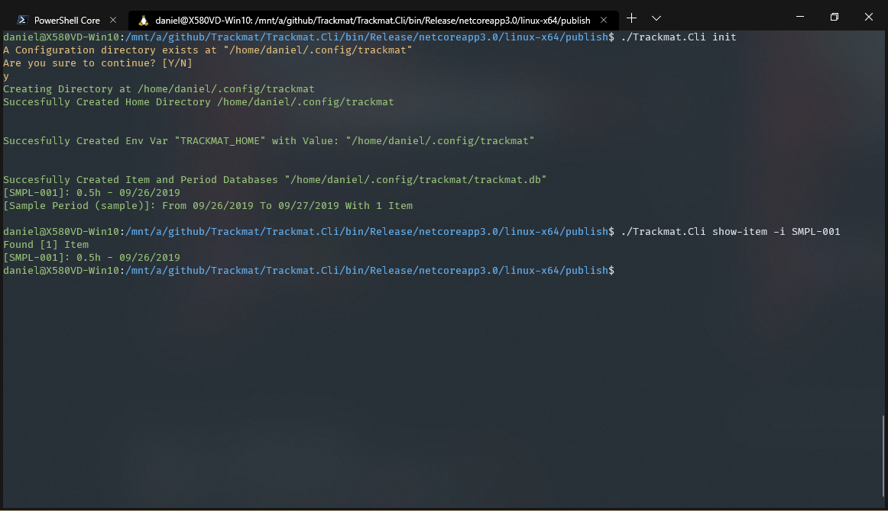
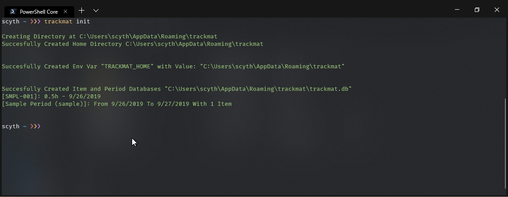
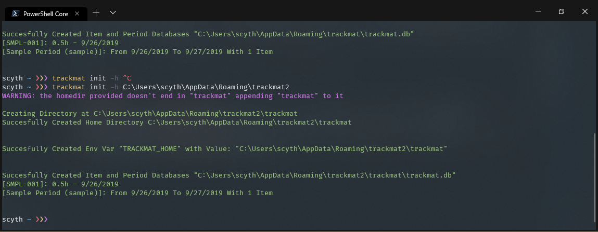
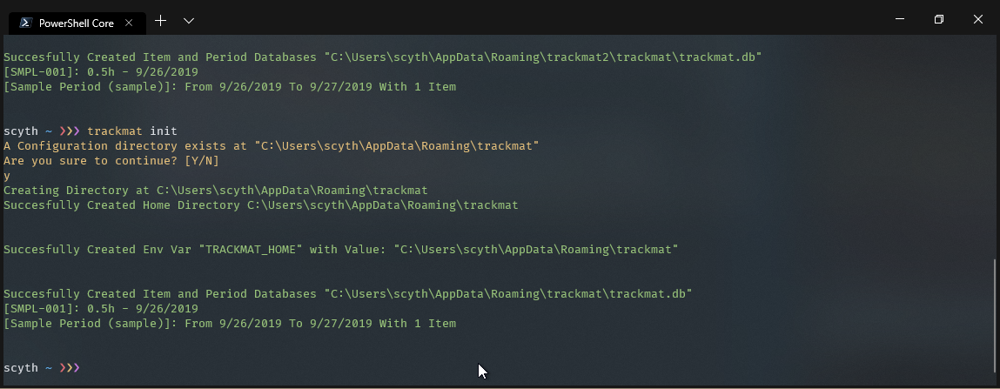
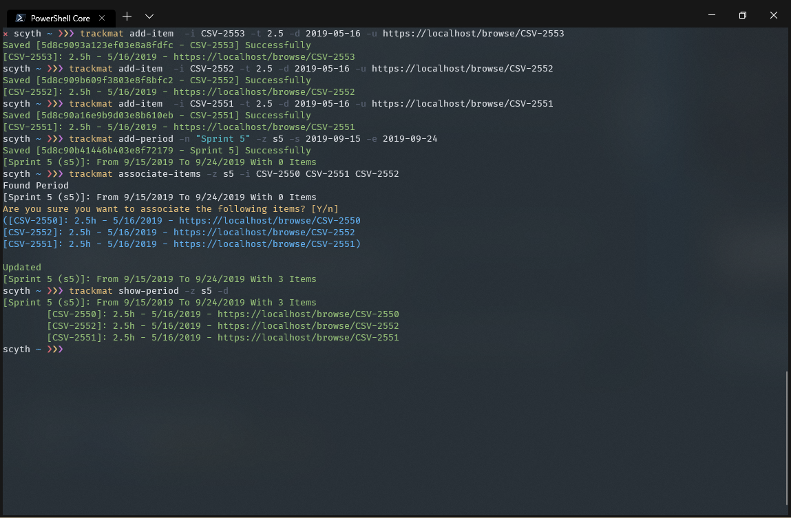

# Trackmat

Trackmat is a small utility console app that helps me track my Jira/Github/Gitlab Tickets and overtime.


```
scyth ~ ❯❯❯ trackmat help
Trackmat.Cli 1.0.0.0
Copyright (C) 2019 Tunaxor Apps.

  init                Helps you initialize the application and set some defaults

  add-item            Add a new item to the tracker.

  show-item           Shows an existing item either by id or by name

  update-item         Updates an existing item in the tracker.

  delete-item         Deletes an existing item (or items) by id or name

  add-period          Add a new period to the tracker.

  show-period         Shows an Existing Period found by easy name

  update-period       Updates an existing period from given easy name and update properties

  associate-items     Associates multiple Items to a period by their Easy Name

  dissociate-items    Dissociates multiple Items to a period by their Easy Name

  delete-period       Deletes a period, if a period has items it will ask for dissociation

  help                Display more information on a specific command.

  version             Display version information.

scyth ~ ❯❯❯
```

You can find a Standalone `exe` file in the [Releases Page](https://github.com/AngelMunoz/Trackmat/releases)

I recommend you to set up a Powershell profile so you can alias `Trackmat.Cli.exe` to `trackmat`
or simply put the exe file in your `PATH` and run `Trackmat.Exe`


#### Powershell Profile
If you use vs code run the following

```
scyth ~ ❯❯❯ code $profile
or
scyth ~ ❯❯❯ notepad $profile
```
this will open your current powershell profile then just append the following line

```
Set-Alias -Name trackmat -Value "C:\PATH\TO\YOUR\TRACKMAT\DIRECTORY\Trackmat.Cli.exe"
```
and that's it you should be able to type `trackmat` in your Powershell console without any problems

#### Linux
Linux is supported!
Follow the same process with your `.profile` or  `.bash_aliases`
```
alias trackmat='/PATH/TO/YOUR/TRACKMAT/DIRECTORY/Trackmat.Cli'
```
### Notes for Linux Users
Setting an env variable to the user level is not supported by .net core
>On .NET Core on macOS and Linux systems, calls to the SetEnvironmentVariable(String, String, EnvironmentVariableTarget) method with a value of EnvironmentVariableTarget.Machine or EnvironmentVariableTarget.User are ignored.

So you will need to set your `TRACKMAT_HOME` variable manually either in your `.profile` or `.bashrc` file
```
export TRACKMAT_HOME="$HOME/.config/trackmat"
```
and then run the `trackmat init` command
Here's an example using Ubuntu in WSL 2



## Usage

Before you can start working/adding items to `trackmat` you need to run the init command first

Trackmat creates a user env variable set to [Environment.SpecialFolder.ApplicationData](https://docs.microsoft.com/en-us/dotnet/api/system.environment.specialfolder?view=netcore-3.0)
you can also pass a custom directory if that fit your needs, trackmat will append trackmat at the end of the directory you want to use, for example

if you want to go back to the original directory you will need to edit the `TRACKMAT_HOME` env variable by hand because Trackmat Will try to start clean wherever you tell it to do so



### Items
Adding items is quite simple, if you get stuck use the help command
```
scyth ~ ❯❯❯ trackmat add-item help
Trackmat.Cli 1.0.0.0
Copyright (C) 2019 Tunaxor Apps.

ERROR(S):
  Required option 'i, item' is missing.
  Required option 't, time' is missing.

  -i, --item    Required. Item to be saved. Ex. "CSD-4550" or "Overtime"

  -t, --time    Required. Amount of time it was worked on expresed in hours. Ex. 3.5 equals three hours and a half

  -d, --date    Date when the item was worked on. Ex. 2020-05-16

  -u, --url     Url linking to a reference on this work. Ex. https://work-item-ticket-url.xyz

  --help        Display this help screen.

  --version     Display version information.

scyth ~ ❯❯❯
```
Ex.
```
scyth ~ ❯❯❯ trackmat add-item  -i CSV-2550 -t 2.5 -d 2019-05-16 -u https://localhost/browse/CSV-2550
Saved [5d8c9012b7759c03e859a0be - CSV-2550] Successfully
[CSV-2550]: 2.5h - 5/16/2019 - https://localhost/browse/CSV-2550
scyth ~ ❯❯❯
```

### Periods
Periods are groups of Items they serve the purpose to organize several items in one group


Periods have a Name like `Sprint 5` but also a short and easy name like `s5` or `sprint5` you are free to choose both, the easy name will be used to search and perform Updates/Deletions on your periods and is usually set with the flag `-z`


# Eventually...

- [ ] Import/Export Items and Periods to/from JSON and CSV;
- [ ] List Items without specifying a name
- [ ] List periods without specifying an easy name

### At consideration
>dump all the database to JSON or CSV

> UWP App